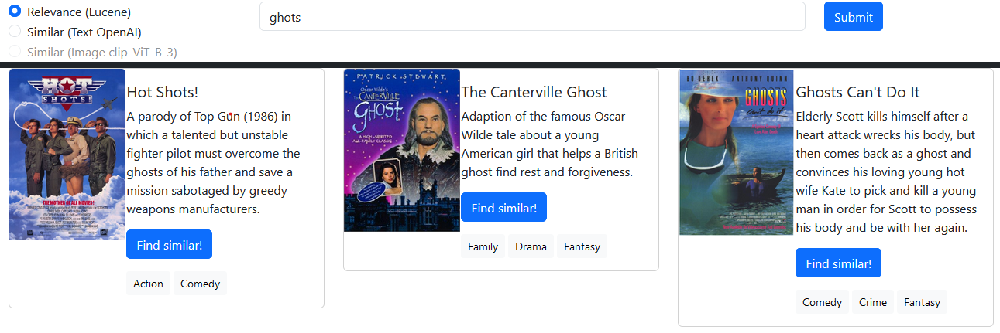

# Database search, Relevance search, Semantic embeddings search with MongoDB

## Introduction

Offering a great user Search experience in applications can be difficult, but does not need to be.

This application combines several search techniques available in MongoDB on an operational dataset of movies. MongoDB is a very popular document database known for its powerful transactional and analytical capabilities on structured and semi-structured data in a JSON-like structure. The addition of relevance search and semantic vector search in the same platform and query language is very easy and simple to use, without much complexity. As a vector database, it now also stores unstructured data such as text, images, or audio, in vector embeddings (high-dimensional vectors) to make it easy to find and retrieve similar objects quickly. 

- transactional database search (`MongoDB`),
- relevance search with MongoDB Atlas Search (`Lucene`),
- semantic search with MongoDB Atlas Vector Search based on embeddings for text (`text-embedding-ada-002`),
- semantic search with MongoDB Atlas Vector Search based on embeddings for images (`clip-ViT-B-32`),

Atlas Search allows relevance search and scoring capabilities based on open-source Lucene indexes. Here, I use it to search relevant movies with language support and typo correction.

Each movie's plot is ran through OpenAI's embedding API and those `text-embedding-ada-002` embeddings are stored in MongoDB. The user's prompt is embedded and used to query in the vector database for similar content.

Each movie's poster image is interpreted by `clip-ViT-B-32`. Those picture embeddings are stored in MongoDB. The user can find movies with poster images that are similar to their query.

## Set-up environment

You need `python3` and `pip`.

    python3 --version
    python3 -m ensurepip --upgrade
    pip3 install -r requirements.txt

You need a `MongoDB Atlas` cluster. This can be a free cluster, created on [cloud.mongodb.com](https://www.mongodb.com/atlas/database). Ensure database access and network access allow you to make a connection to the database. Note free clusters have a size and performance limitation, feel free to run this on a small paid cluster with lots more data.

You need to set some local environment variables, this can be local `.env` file

    MDB_CONN=<YOUR MongoDB Atlas connection string>
    DB="sample_mflix"
    COLL="embedded_movies"
    OPENAI_API_KEY=<YOUR OpenAI API key>

## Preparing the data

### Option1: Load from a backup

Clone the [mdb-search-data repo](https://github.com/dvsander/mdb-search-data), unrar the dump and from the project directory, run the `mongorestore` to restore the `sample_mflix and `embedded_movies collection. You will need the [MongoDB command line database tools](https://www.mongodb.com/try/download/database-tools) for this.

    mongorestore --uri="mongodb+srv://..."

### Option 2: Create the vector search embeddings yourself on any collection

Load the sample dataset from MongoDB Atlas. It's available with the `...` in the cluster view. When that's done, run the `util.py` utility.

    python util.py

Attention: It will download pictures for movies and for those pictures create the embeddings using the `clip-ViT-B-32` model. This might take a while. Could be optimized with multithreading locally and batch insert_manys. It's normal that you run out of disk space around movie 3000 on the free tier, you can ignore the message.

## The good stuff: enable the relevance search and vector search in MongoDB Atlas

In Atlas, in the cluster view `Search tab`, enter the following JSON configuration. Use the `default` index name and ensure to create it on the `embedded_movies` collection. This is the magic that will enable dynamic full text search on fields, as well as enable the vector search indexes. No data copy needed :o 

    {
        "mappings": {
            "dynamic": true,
            "fields": {
                "plot_embedding": {
                    "dimensions": 1536,
                    "similarity": "cosine",
                    "type": "knnVector"
                },
                "poster_embedding": {
                    "dimensions": 512,
                    "similarity": "cosine",
                    "type": "knnVector"
                }
            }
        }
    }

## Time to run it

This is a Flask Python3 web-app.

Start the Flask app like this

    flask --app app run

Or with a helper just use python like this

    python app.py

You can access the web app at `http://localhost:5000`.

You can now:

- use the full text search from the input field to find 'any' random set of movies with relevance search
- use the OpenAI text embeddings dearch to find movies similar to the text sentiment you enter, sounds exotic!
- click the button on one of the movies and see 'similar movie posters', see what happens :)

Trust the ML and the embedding model. Can you guess why these pictures are similar?
